The main reference i would be taking from is basically using a lab from cyberdefenders named FakeGPT
I will be taking a general extension approach for basically checking how we can check malicious browser extensions then we will be proceeding towards the attacks techniques which are basically used in this lab.
For the downloading tutorial i will basically be utilizing google translate extension
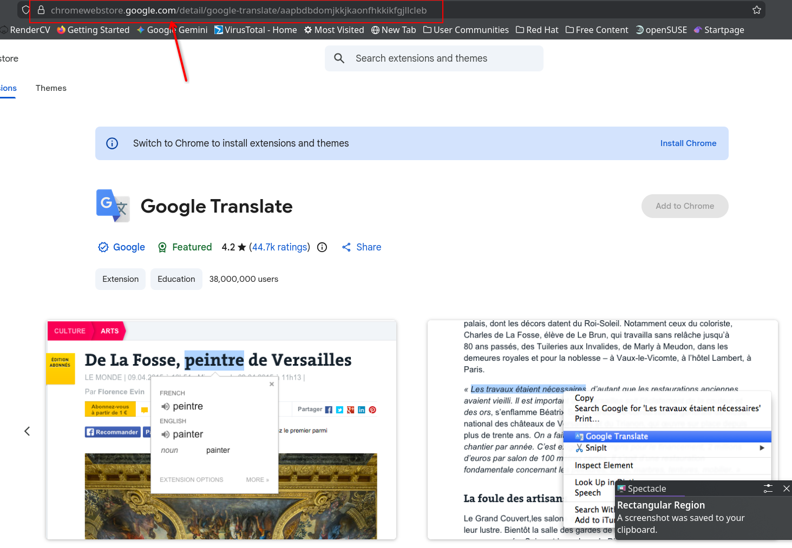
Here in the address bar we find a URL we need to copy this and we can basically head over to a crx downloader to download this extension
For the downloading purpose I am using 
```
https://www.crx4chrome.com/crx-downloader/
```


Now we can basically paste the url and get the files for the extension

After downloading the file 
```
mv AAPBDBDOMJKKJKAONFHKKIKFGJLLCLEB_2_0_16_0.crx extension.zip
```
Since rename it as zip file so we can extract it 
Now basically unzip the zip file 
You will now be having the extension files

For this tutorial i will be analysing the fakegpt extension which is basically provided by the cyberdefenders platform.
https://cyberdefenders.org/blueteam-ctf-challenges/fakegpt/

Now we have to download and extract the zip file so that we can get the files of the malicious extension
Let us first look at the html file if we find something interesting
This is basically just some basic HTML nothing interesting so we can basically move on to exploring other files which could be of our interest.
Now we also the manifest file here this is basically referred to as the brain of the extension so this can reveal some interesting information about the working of the extension basically
Now there are two things we find which could be paricularly of value to us.
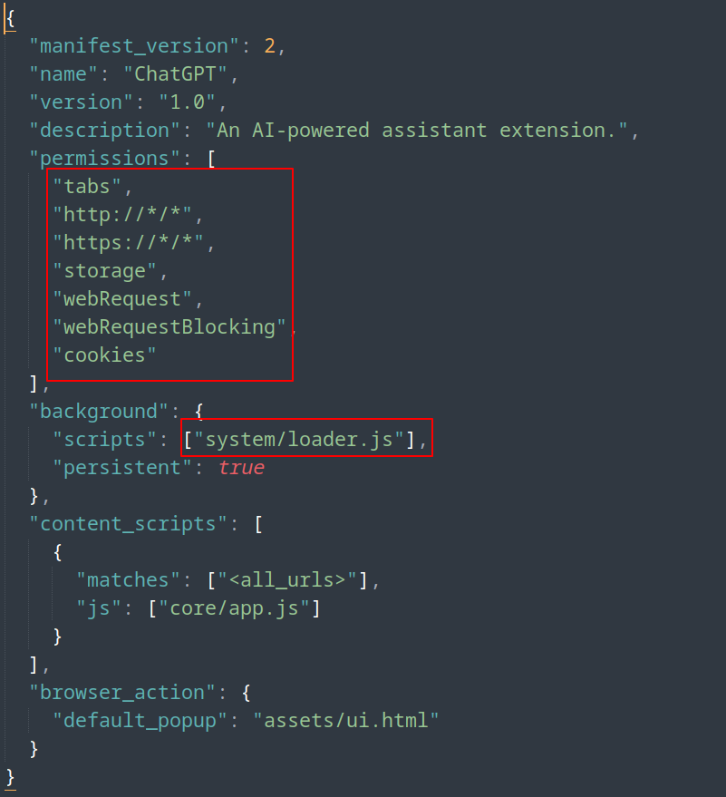
Here a background js file is running this could be the harmful file, one another thing to be noted is that the permissions of the extension like cookies, storage these could be used to steal the cookies and data of the user.
Now let us check the refernced file app.js and loader.js and check what could we basically interpret from this
The extension checks `window.location.hostname` and is actively looking for facebook.com
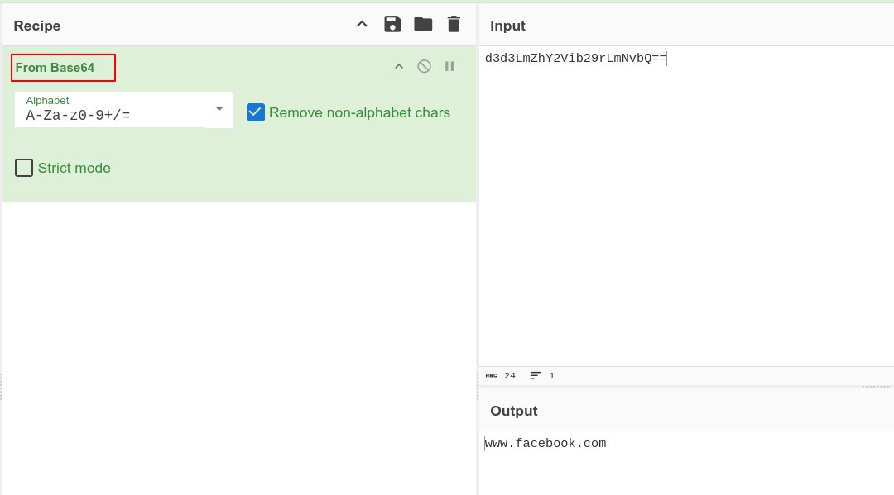
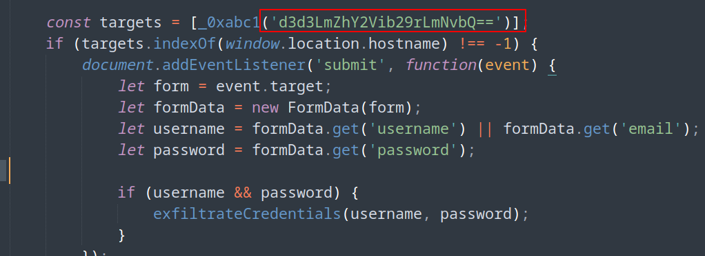
We can check that inside app.js
Now exploring further functions 
The extension is basically using this function for extracting the credentials
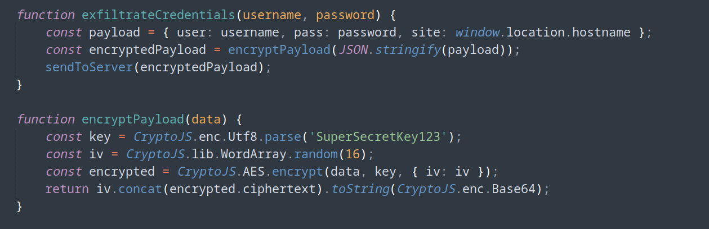
Now after taking out the credentials it is basically encoding it using AES-IV using the key SuperSecretKey123
Data is transmitted via GET requests to `https://mo.elshaheedy.com/collect`, with the encrypted payload appended as a URL parameter.
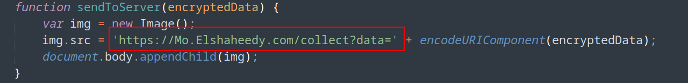
Now we can basically check other files we have the full working mechanism here only but we have to look basically what is present in other files
crypto.js is also the encryption only same function is implemented there
Now check the last file
This one is interesting we are basically having a vm check setup 
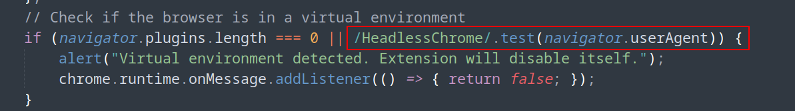
This is not fullproof or not very good but is good for basic malicious extensions

Now let us try to map the attack scenerio with MITRE ATT&CK
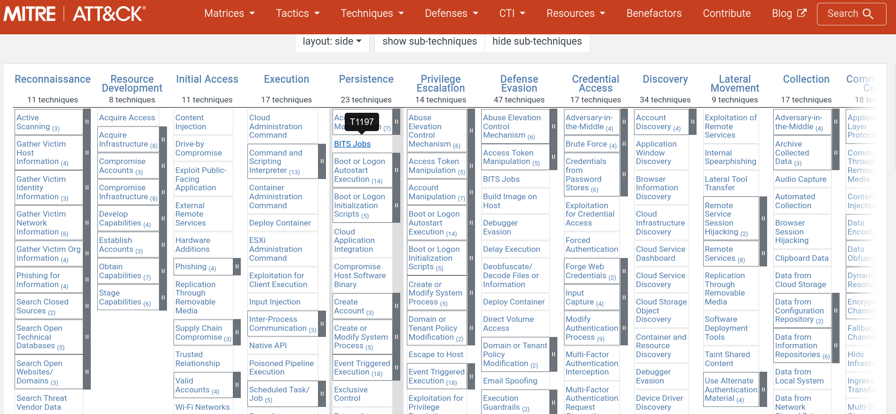

Let us start with the Initial access phase 
Here the user basically installs a malicious extension try to mimic chatgpt
So we can map it to user execution phase
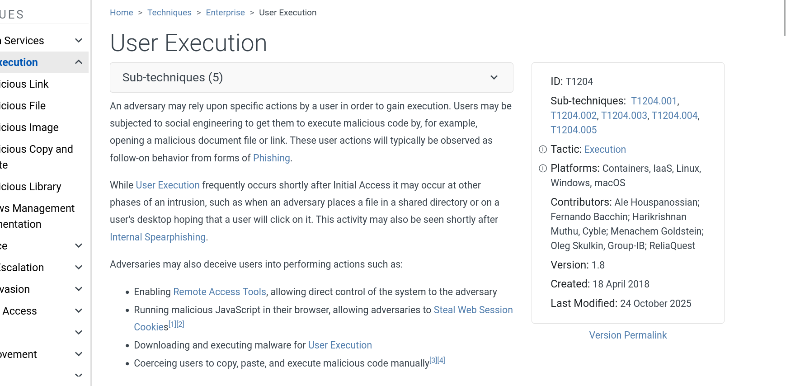
Now we have to find the sub-technique which the attacker basically used
If we basically move to malicious files section in this category
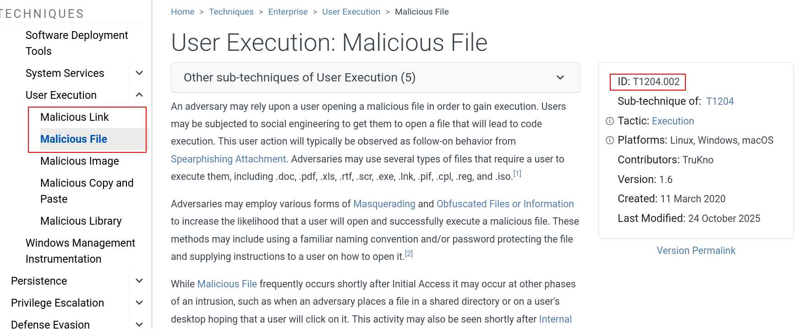
We now have the attack ID and technique involved
Now let us move to how the attacker is basically trying to evade the defenses where we found it related to the virtualization so let us move to MITRE ATT&CK framework and try mapping that again
These are the techniques and subtechniques used by the attacker to detect the sandbox environment
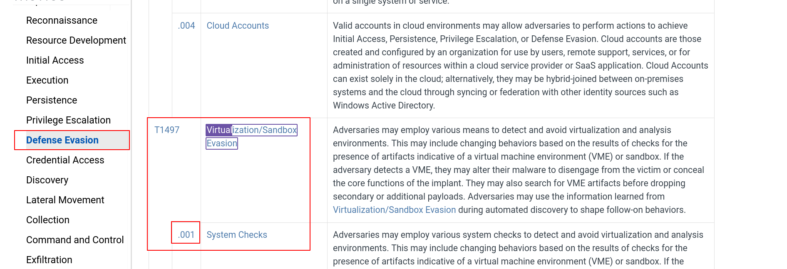
Now another thing we have is the attacker basically tried to encrypt the payload he is sending using AES cryptography and target is also stored a base64 code not directly facebook.com
I would put the base64 encoding in the T1027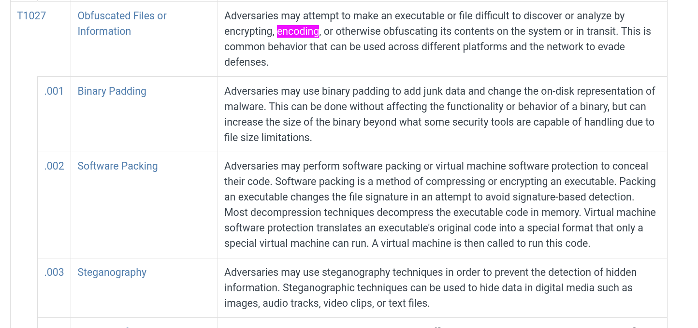
For the subtechnique it basically is 
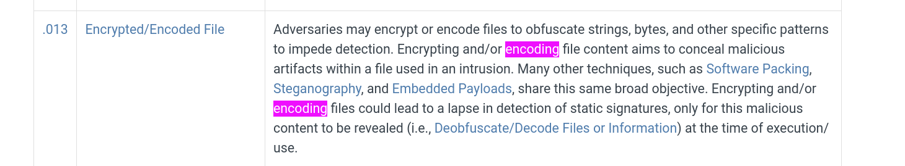
Even though the decoded output is not particulary malicious but is still hidden and used to perform some malicious process so it would be feasible to putting it here in this subcategory
as far as the cryptographic part is concerned we can map that 
T1027.002
Now if we check for the discovery what information it has basically tried to get about the system, it basically uses reads `navigator.userAgent` and `navigator.plugins` to profile the environment we can see that in the extension code

So we can basically map it this 
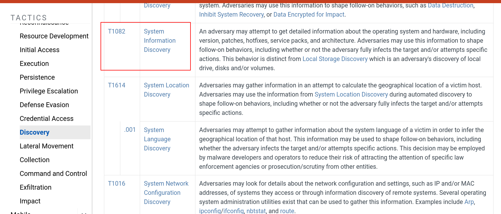

Now for the data accessing part it basically logged keystrokes on facebook.com and basically cookies which we already analysed in the extension code
Also in the ' app.js ' file we also see that there is basically a event which is capturing keystrokes
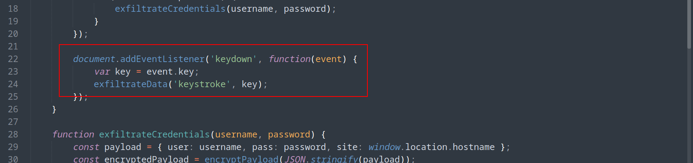
This basically logs every keystroke on facebook.com
If we map this according to the MITRE ATT&CK framework, this basically falls under the collection phase If we observe the technique T1185 most closely aligns with the attack vector
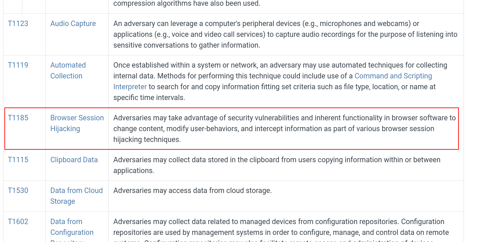
One another important detail in the file is that here we can see it is basically setting up a listener at the submit button.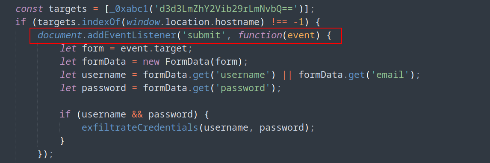
Now what this basically is doing that setting the username and password to some variables and basically trying to exfilterate the data through the exfilterateCredentials function.

Here also the main function is credential access so we need to map it into that category
Here it closely aligns to two categories one is basically T1555.003 and T1056.003 but here we will be mapping it to as the browser passwords are not compromised at this point this is basically just a captive portal where a keylogging service is basically set up.
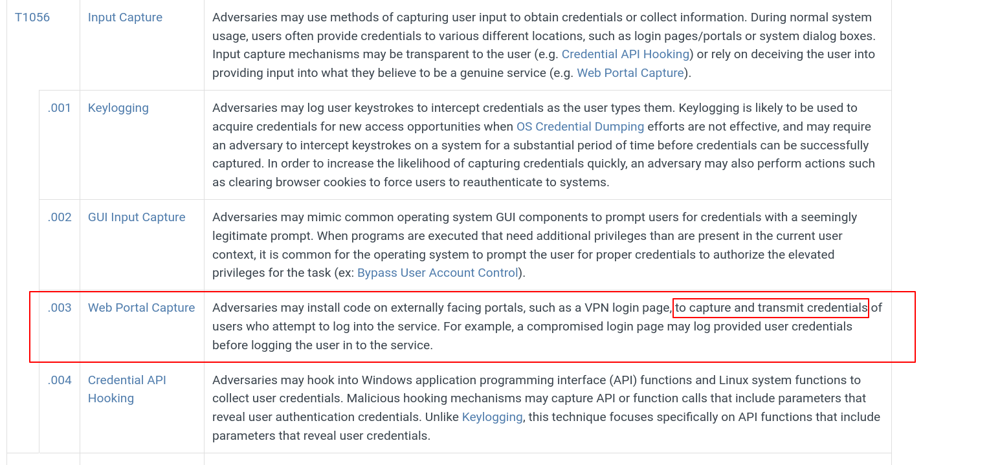
Now for the last phase basically how this data is being exfilterated
This part of code in the app.js basically defines how data is being exfilterated
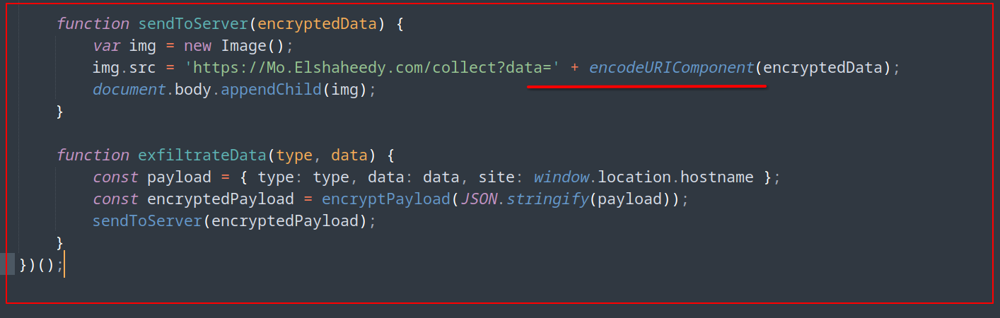
The encoded data which we already using MITRE ATT&CK framework is being transmitted in basically url parameter using img.src 
Now if we try to map this particular technique
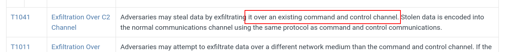 Since this is being sent using the normal website by just something like url parameter of img. So we can basically map it to T1041 technique
Credits for the vulnerable extension: Cyberdefenders
This is the whole process of the detection of the fakegpt.
Thank you very much for reading :)
