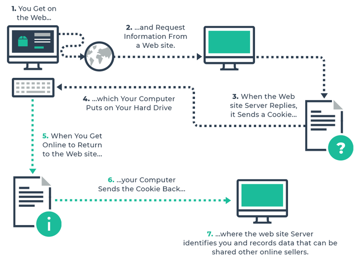

The flow of the blog would be **Concept -> Implementation -> Exploitation -> Defense -> Modernization.**
This blog would be covering both the attacker and developer point of view for authentication so please continue reading.

## Part 1: Fundamentals
Now we are first of all creating a baseline so everyone is able to understand whatever we will be discussing in the future blog. The goal of the blog is to make the systems secure, anyone who wants to know how can they improve the security of there application could use this as a reference.

Without wasting much time further we will start with what are cookies and why are they even required and why I am referring to authentication and why is it even required for web application and what could be the consequences if they are not implemented properly

### Problem with HTTP
As we know http is the language of the web be it normal http or encrypted https.
So the problem is that HTTP is stateless, now what that means is that http does not know this guy gave me a correct username and password earlier so he is the one who should be authorized to perform something or not even if you do not perform a login , suppose you are buying a item in Amazon you add something to cart, now how will Amazon know that this was the person that added that item to cart, this basically happens with the help of cookie, so one thing which you might also be thinking of now is that if someone steals this cookie in some cookie, would it be possible to forge as other user and perform the actions that were supposed to be performed by that particular person.


### Anatomy of a cookie


Developers often rely on frameworks to handle cookies and never look at the raw HTTP headers. We need to look at the raw bytes to understand security.

Request Header Sample
```
GET /profile HTTP/1.1
Host: www.example.com
User-Agent: Mozilla/5.0 ...
Accept: text/html
Cookie: theme=dark; sessionId=abc12323131231; tracking_id=xyz789
```
The browser sends these blindly. It doesn't know what `sessionId` means. It is just echoing back what the server previously told it to remember.
So attackers try to utilize this for their own advantage.

Response Header Sample
```
HTTP/1.1 200 OK
Content-Type: text/html
Set-Cookie: sessionId=abc12323131231; Expires=Wed, 21 Oct 2026 07:28:00 GMT; Secure; HttpOnly; SameSite=Strict; Path=/admin; Domain=example.com
```
The _name_ is `sessionId`, the _value_ is `abc123`. Everything after that is an _attribute_ that dictates how the browser must treat it.

### Attritbutes of Cookies and their Security Implication
Every cookie carries a set of attributes that dictate exactly how, when, and where it can be used. Think of these as the fine print - the rules the browser enforces on the cookie's behalf, whether the server intended them carefully or forgot to set them at all.

**Name=Value** - The actual piece of data being stored, like `session_id=a3f9c2`. This is the only mandatory part of a cookie; everything else below is optional metadata attached to it.

**Domain** - Determines which host(s) the cookie gets sent to. If left unset, it defaults to the exact host that issued it, with no subdomains included. If explicitly set, it extends to subdomains as well.

**Path** - Restricts the cookie to a specific URL path, such as `/account`. The browser only attaches the cookie to requests matching that path or anything below it.

**Expires / Max-Age** - Governs how long the cookie sticks around. No expiry means it's a session cookie, wiped when the browser closes. When both are present, `Max-Age` overrides `Expires`.

**Secure** - Ensures the cookie is only transmitted over HTTPS connections. It doesn't encrypt the cookie's contents, just prevents it from traveling over plain HTTP.

**HttpOnly** - Blocks JavaScript from reading the cookie via `document.cookie`. This is one of the main defenses against cookie theft through XSS attacks.

**SameSite** - Controls whether the cookie is sent along with cross-site requests. `Strict` withholds it entirely on cross-site requests, `Lax` allows it on top-level navigation, and `None` sends it cross-site but requires `Secure` to be set alongside it.

This particular section is more important from security point of view not as crucial for basic flow.

### Storing of the Cookies
There is a great debate among security researchers that where should cookies be stored and that actually depends on a lot of things.
**LocalStorage & SessionStorage** - This is having both pros and cons, as for developer point of view because it offers storing huge amounts of data, no expiration, easier to handle in JavaScript logic.
But from the security point of view, no advantages. JavaScript can access it instantly. It is the first thing malware and XSS payloads look for.
**Cookies**- Same is the case for cookies too for developers Size limit (4KB), sent on every HTTP request (adds overhead) is a con.
From the security point of view it can be locked down with `HttpOnly` and `Secure`.
**IndexedDB** - Similar to LocalStorage but asynchronous and can store complex data. Same security risks
In short, if a token is meant to be read by a server, it belongs in a locked-down Cookie. If a token is meant to be read by JavaScript (like an Access Token for an SPA), it is inherently vulnerable to any third-party script running on your domain.

### Part 2  Authentication Architectures (How to Issue the Cookie)
We could say that this is a developer's guide for how attackers think and what will they try to attack the application.
We will be discussing about both stateful and stateless way as well as a hybrid architecture
### Stateful Authentication(Server Side Sessions)
 **Flow**
 ```
 - User logs in.
    
- Server generates a cryptographically random string (e.g., 128-bit entropy).
    
- Server stores data in Redis/Memcached: `Key: abc123` -> `Value: {userId: 1, role: admin}`.
    
- Server sends cookie: `Set-Cookie: sessionId=abc123131421`.
 ```

For developers
- Can log users out immediately. Easy to change permissions instantly.
- But doesn't scale horizontally easily (requires central session store) so increasing one more dependency.
For security people
- These are easy to audit. If the ID is sequential or guessable (`sessionId=1001`), it’s game over so id might be not guessable.
### Stateless Way( Using JWT Token)
**Flow**
```
- User logs in.
    
- Server creates a JSON payload (Header, Payload, Signature).
    
- Base64 encodes it.
    
- Sends it in a Cookie or LocalStorage.
  
```

```
Note:- **LocalStorage:** Convenient for devs. **But:** Any XSS = Token stolen. Period.
    
- **Cookie (with `HttpOnly`):** XSS cannot read the token. **But:** Vulnerable to CSRF if `SameSite` is not set.
```

For developers
- Great for APIs. Horrible for revocation.
For security professionals
- Look for `alg=none`, weak secrets (e.g., `secret123`), or sensitive data leaking in the JWT payload or some common CVE associated with jwt tokens.

### Hybrid Model
**Access Token:** Short-lived (15 mins), kept in memory (React state/Vuex). Not a cookie.
Make sure the time is not too large and is within advised time duration.
**Refresh Token:** Long-lived (1 month), stored in a cookie (`HttpOnly; Secure; SameSite=Strict; Path=/refresh`).
If XSS happens, attacker gets access for 15 minutes. If CSRF happens, `SameSite=Strict` blocks it.
## The Golden Rule of Token Storage

|Token Type|Storage Location|Accessible to JS?|Sent to Server How?|
|---|---|---|---|
|**Access Token**|Memory (React State/Closure)|Yes|`Authorization: Bearer <token>` header|
|**Refresh Token**|HTTP-only Secure Cookie|**No**|Automatically by browser on `/refresh` endpoint|

The refresh token lives in a cookie with these flags:

Set-Cookie: __Host-refresh=eyJhbGc...; Secure; HttpOnly; SameSite=Strict; Path=/refresh; Max-Age=2592000

Because it has `HttpOnly`, JavaScript literally cannot read it. Even if an attacker achieves full XSS on your React app, they cannot steal the refresh token.

The actual react code for this
```
// Login.jsx
const handleLogin = async () => {
  const response = await fetch('/api/login', {
    method: 'POST',
    headers: { 'Content-Type': 'application/json' },
    body: JSON.stringify({ email, password }),
    credentials: 'include' // CRITICAL: Tells browser to store and send cookies
  });
  
  // Response comes back with access token in BODY (not cookie)
  const data = await response.json();
  
  // Store access token in MEMORY only (not localStorage!) as it is a better //option
  setAccessToken(data.accessToken);
}
```
This code is for setting the access token for a user
Also when the access token expires
```
// apiClient.js (continued)
export const apiFetch = async (url, options = {}) => {
  let response = await fetch(url, {
    ...options,
    headers: { ...options.headers, 'Authorization': `Bearer ${accessToken}` },
    credentials: 'include'
  });
  
  // If server says "401 Unauthorized" (access token expired)
  if (response.status === 401) {
    // Attempt to refresh the token
    const refreshed = await refreshAccessToken();
    
    if (refreshed) {
      // Retry the original request with the new token
      response = await fetch(url, {
        ...options,
        headers: { ...options.headers, 'Authorization': `Bearer ${accessToken}` },
        credentials: 'include'
      });
    } else {
      // Refresh failed, redirect to login
      window.location.href = '/login';
    }
  }
  
  return response;
};

const refreshAccessToken = async () => {
  // Call the /refresh endpoint
  // The browser automatically sends the __Host-refresh cookie
  const response = await fetch('/api/refresh', {
    method: 'POST',
    credentials: 'include' // This sends the HttpOnly cookie automatically
  });
  
  if (response.ok) {
    const data = await response.json();
    setAccessToken(data.accessToken); // Update memory with new access token
    return true;
  }
  
  return false;
};
```
This is done automatically by the browser on the refresh endpoint once access token expires

The refresh token logic for the developers

1. Browser sends `POST /api/refresh` with the `__Host-refresh` cookie automatically.
    
2. Server reads the refresh token from the cookie.
    
3. Server validates:
    
    - Is it in the database?
        
    - Is it expired?
        
    - Has it been revoked?
        
    - **Rotation check:** Has this token been used before? (Refresh token rotation)
        
4. **If valid:**
    
    - Generate a **new** refresh token.
        
    - Store the new one in the database.
        
    - Invalidate the old one (rotation).
        
    - Generate a new access token.
        
    - Send response:
        
        - **Body:** `{ accessToken: "new_jwt" }`
            
        - **Cookie:** `Set-Cookie: __Host-refresh=<new_opaque_token>; HttpOnly; Secure; SameSite=Strict; Path=/refresh`
            
5. **If invalid:**
    
    - Clear the cookie (`Set-Cookie: __Host-refresh=; Max-Age=0`).
        
    - Send `401 Unauthorized`.

### Why this model was required?
If you store the refresh token in `localStorage` or React state:

1. **XSS Attack:** Attacker injects malicious script through a compromised npm dependency or user input.
2. **Token Theft:** The script reads `localStorage.getItem('refresh_token')` and sends it to the attacker.
3. **Permanent Access:** Since refresh tokens typically last 30+ days, the attacker can mint new access tokens indefinitely until the user logs out or the token expires.

I think the blog is quite blog large for now so let's stop here
This is part 1 of the blog from my side stay tuned for further information, will be uploading the part 2 in a few days.
In the next part we will be diving deeper how does this affect you and what misconfigurations are commonly done by the developers in implementing these cookies.
Thank You for reading :)
